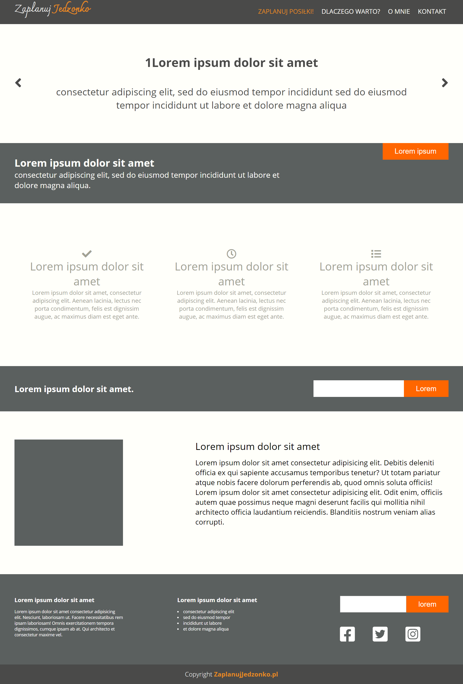
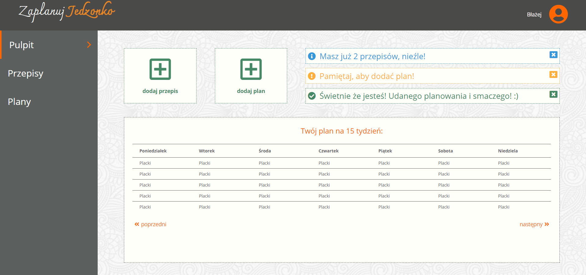

## Table of contents
* [General info](#general-info)
* [Technologies](#technologies)
* [Sources](#sources)
* [Inspiration](#inspiration)
* [Available Scripts](#available-scripts)
* [Screenshots](#screenshots)

# General info
The first application based on SCRUM methodology and JavaScript technology created by: Piotr Sitarek, Edyta Pawelska, Błażej Bałruszewicz. We had just 5 days to write this application. We made all the 'must have' tasks and a few 'should have'. I think that we have learned a lot during these days and we perform very well.

The assumptions of the application are:
* recipe creation
* creating nutrition plans
* creating and displaying a weekly nutrition plan
* keeping all data in localStorage

## Technologies
Project is created with: 
* HTML5
* CSS 3
* JavaScript
* localStorage

## Available Scripts
`gulp` or `gulp serve`  - runs GULP in `watchmode`. Page will be run on `localhost` it will be refreshed whenever you change any `scss`, `js` or `html` file.

`gulp watch` - runs GULP w trybie nadzoru, in supervision mode, it will compile `main.scss` in `css/main.css`

`gulp sass` - Compiling SASS to CSS

## Screenshots

